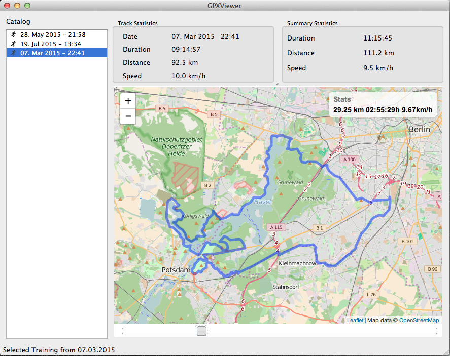

## GPXViewer

``GPXViewer`` is a python gui to view .gpx files. The basic facilities are
a catalog for trainings and a map to trace the individual track.

### Screenshot

### Todo

 - Better handling of data files eg. copying to some directory etc
 - nicer summary statistics (some barcharts maybe)

